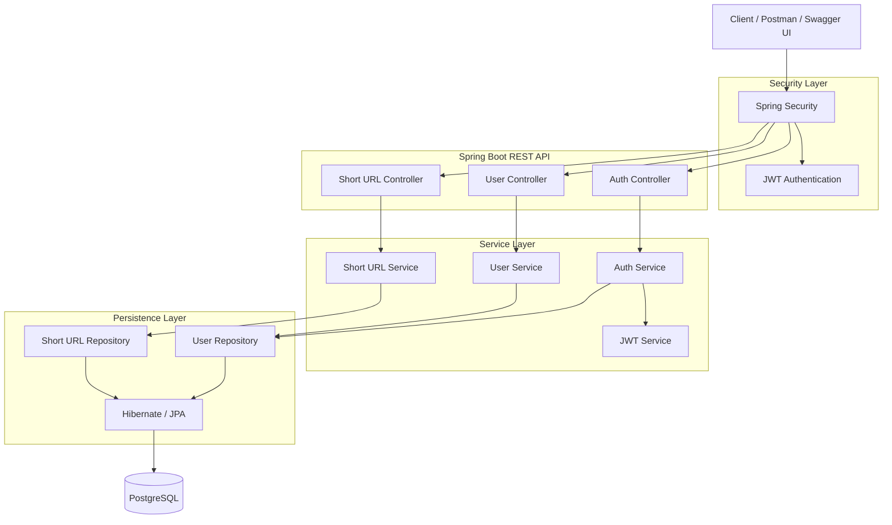

# 🔗 URL Shortener API

A production-oriented URL Shortener REST API built with **Java, Spring Boot, Spring Security, JWT, PostgreSQL, JPA/Hibernate, Docker, Docker Compose, and Swagger/OpenAPI**.

The application allows authenticated users to create, manage, and track shortened URLs while providing public short-code redirection.

## ✨ Features

- User registration and authentication
- JWT-based stateless authentication
- Spring Security protected endpoints
- Create shortened URLs
- Redirect using short codes
- Retrieve URLs belonging to the authenticated user
- Update shortened URLs
- Delete shortened URLs
- Click-count tracking
- Optional URL expiration support
- User ownership validation
- Input validation
- Centralized global exception handling
- Meaningful HTTP status codes and error responses
- PostgreSQL persistence
- JPA/Hibernate ORM
- Swagger/OpenAPI API documentation
- Docker containerization
- Docker Compose setup for application + PostgreSQL

---

## 🏗️ System Architecture



The Mermaid source is also available in:

`url-shortener-architecture.mmd`

---

## 🛠️ Technology Stack

| Technology | Purpose |
|---|---|
| Java | Application development |
| Spring Boot | REST API and application framework |
| Spring Security | Authentication and authorization |
| JWT | Stateless authentication |
| Spring Data JPA | Data access |
| Hibernate | ORM |
| PostgreSQL | Relational database |
| Maven | Dependency management and build |
| Swagger / OpenAPI | API documentation |
| Docker | Application containerization |
| Docker Compose | Local multi-container environment |
| Postman | API testing |

---

## 🔐 Authentication Flow

The application uses JWT-based stateless authentication.

```text
Register
   ↓
POST /api/users/register
   ↓
User created
   ↓
Login
   ↓
POST /api/auth/login
   ↓
JWT generated
   ↓
Client sends:
Authorization: Bearer <JWT>
   ↓
Spring Security validates token
   ↓
Protected endpoint is accessed
```

---

## 🔗 API Endpoints

### User

| Method | Endpoint | Description |
|---|---|---|
| POST | `/api/users/register` | Register a new user |

### Authentication

| Method | Endpoint | Description |
|---|---|---|
| POST | `/api/auth/login` | Authenticate user and obtain JWT |

### Short URLs

| Method | Endpoint | Authentication | Description |
|---|---|---|---|
| POST | `/api/urls` | Required | Create a short URL |
| GET | `/api/urls/my` | Required | Get URLs belonging to current user |
| PUT | `/api/urls/{shortCode}` | Required | Update a short URL |
| DELETE | `/api/urls/{shortCode}` | Required | Delete a short URL |
| GET | `/{shortCode}` | Public | Redirect to the original URL |

---

## 🔄 How URL Shortening Works

1. An authenticated client submits an original URL.
2. The service generates a unique short code.
3. The URL mapping is persisted in PostgreSQL.
4. The generated short URL is returned to the client.
5. A request to `/{shortCode}` looks up the mapping.
6. The service validates the URL and expiration status.
7. The click count is incremented.
8. The client is redirected to the original URL.

Example:

```text
Original:
https://github.com

Short:
http://localhost:8080/BmdLTM
```

---

## 🗄️ Database

PostgreSQL is used as the primary relational database.

JPA/Hibernate handles entity mapping and persistence.

The application stores user information and shortened URL mappings, including ownership, short codes, original URLs, click counts, timestamps, and expiration information where configured.

---

## 🧱 Application Architecture

The project follows a layered architecture:

```text
Controller
    ↓
Service
    ↓
Repository
    ↓
JPA / Hibernate
    ↓
PostgreSQL
```

### Controller Layer

Handles HTTP requests, validation, and API responses.

### Service Layer

Contains business logic such as URL generation, authentication, ownership checks, and redirect processing.

### Repository Layer

Uses Spring Data JPA repositories for database operations.

### Security Layer

Spring Security and JWT protect authenticated endpoints.

### Exception Handling

Centralized exception handling provides consistent responses for conditions such as:

- User not found
- Short URL not found
- Expired short URL
- Unauthorized URL access
- Invalid requests

---

## 🐳 Docker

The project includes Docker support for reproducible local environments.

### Build the application image

```bash
docker build -t url-shortener-api .
```

### Run with Docker Compose

```bash
docker compose up
```

Docker Compose starts the Spring Boot API and PostgreSQL database.

To stop the containers:

```bash
docker compose down
```

To stop containers and remove the local database volume:

```bash
docker compose down -v
```

> `docker compose down -v` deletes the local PostgreSQL data volume.

---

## ▶️ Run Locally Without Docker

### Prerequisites

- Java 25+
- Maven
- PostgreSQL
- Git

Clone the repository:

```bash
git clone https://github.com/jayesh-pandharkar/url-shortener-api.git
cd url-shortener-api
```

Build the project:

```bash
./mvnw clean package
```

Run the application:

```bash
./mvnw spring-boot:run
```

The application runs on:

```text
http://localhost:8080
```

---

## 📚 Swagger / OpenAPI

The project includes Swagger/OpenAPI documentation for exploring and testing the REST API locally.

After starting the application, open:

```text
http://localhost:8080/swagger-ui/index.html
```

Swagger allows API consumers to:

- View available endpoints
- Inspect request and response schemas
- Understand authentication requirements
- Execute API requests interactively

---

## 🧪 Testing

The API was tested using:

- Postman
- Swagger UI
- Local Spring Boot execution
- Docker Compose

Typical verification flow:

```text
Register
   ↓
Login
   ↓
Receive JWT
   ↓
Authorize protected endpoints
   ↓
Create short URL
   ↓
Retrieve user's URLs
   ↓
Update / Delete URL
   ↓
Open short code
   ↓
Verify redirect and click count
```

---

## 🚀 Local Deployment

The application is containerized using Docker and can be run locally with Docker Compose.

```text
Client
  ↓
Spring Boot API
  ↓
JPA / Hibernate
  ↓
PostgreSQL
```

Docker Compose starts the Spring Boot application and PostgreSQL database together.

---

## 📁 Project Structure

```text
url-shortener/
│
├── src/
│   ├── main/
│   │   ├── java/
│   │   │   └── com/jay/urlshortener/
│   │   │       ├── config/
│   │   │       ├── controller/
│   │   │       ├── dto/
│   │   │       ├── entity/
│   │   │       ├── exception/
│   │   │       ├── repository/
│   │   │       ├── security/
│   │   │       ├── service/
│   │   │       └── util/
│   │   │
│   │   └── resources/
│   │       └── application.properties
│   │
│   └── test/
│
├── Dockerfile
├── docker-compose.yml
├── .dockerignore
├── pom.xml
├── README.md
└── url-shortener-architecture.mmd
```

---

## 🚀 Future Improvements

Potential improvements for a larger-scale production deployment include:

- Redis caching
- Rate limiting
- Custom aliases
- QR code generation
- Analytics dashboard
- Pagination
- Database indexing optimization
- Centralized logging
- Monitoring and metrics
- CI/CD pipeline
- Custom domain support

---

## 👨‍💻 Author

**Jayesh Pandharkar**

GitHub:

https://github.com/jayesh-pandharkar

---

## 📄 License

This project is intended as a portfolio and learning project.
